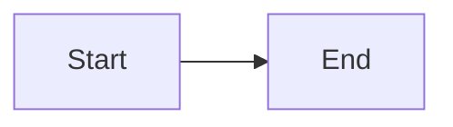

# Closed network: what to copy (e.g. USB)

Open WebUI is designed to run **without calling out to CDNs** for normal chat when you install from the **`open-webui` PyPI wheel**: the web UI, **Mermaid**, **Vega / Vega-Lite** renderers, and **Pyodide** (in-browser Python) ship **inside that package**. Your pilot pins that wheel in `requirements.txt`.

This list is what you need on the **disconnected** machine so chat, **diagrams**, and **charts** keep working.

## 1. This pilot folder (minimum source)

Copy the whole `pilot-open-webui` directory except what you can regenerate:

| Copy | Notes |
|------|--------|
| `requirements.txt` | Pinned stack including `open-webui` |
| `env.example` | Rename/copy to `.env` on the target |
| `scripts/` | `run-pilot.sh`, `run-pilot.ps1`, `vendor-wheels.sh` |
| `prompts/` | Optional: system prompt snippet for charts/diagrams |
| `docs/` | This checklist |

Do **not** rely on the recipient machine having internet for **chart libraries**: they are **not** separate pip packages you add for Mermaid/Vega.

**Optional to copy (often gitignored):**

| Item | When needed |
|------|-------------|
| `.venv/` | Easiest air-gap path: copy the **entire** venv from a matching OS/arch (e.g. Windows → Windows). Mac-built venv is **not** portable to Windows. |
| `wheels-offline/` | Preferred when OS differs: build on a connected machine with `./scripts/vendor-wheels.sh`, then install with `pip install --no-index --find-links=wheels-offline -r requirements.txt`. |
| `data/` | Only if you want existing chats, users, and settings SQLite DB on the USB image. |
| `.webui_secret_key` | Only if you intentionally reuse the same server secret; treat as sensitive. |

## 2. Python runtime (target machine)

- **Python 3.12.x** installed (this pilot targets 3.12; the `open-webui` package version you pinned may not support 3.13+ yet).

## 3. `open-webui` wheel and dependencies

Everything in `requirements.txt` is a **pip** artifact. For a strict closed network:

- Either copy **`wheels-offline/`** (see `scripts/vendor-wheels.sh`) **plus** `requirements.txt`, then install offline, **or**
- Copy a prebuilt **`.venv`** that was created on the **same** OS and CPU architecture as the target.

**No extra wheel** is required specifically for Mermaid or Vega: those assets are **bundled inside** the installed `open_webui` package under `site-packages/open_webui/frontend/`.

## 4. Ollama and models (separate from pip)

Charts in chat are rendered in the **browser** from model output; the model still comes from **Ollama** (or another backend you configure).

| Copy / install | Notes |
|----------------|--------|
| Ollama for the target OS | Install once from media if the machine has no internet. |
| Model blobs | On the connected machine run `ollama pull <model>`; copy Ollama’s model directory to the air-gapped host (paths differ by OS; on Windows typically under the user profile `.ollama`). |

Without local models, chat (and any chart instructions) will not run.

## 5. Hugging Face / embeddings (only if you use RAG)

`OFFLINE_MODE=true` (see `env.example`) aligns with offline use but **does not** download embedding files.

| Copy | When needed |
|------|-------------|
| Populated Hugging Face cache | If you use **Knowledge / RAG / default embeddings**, download once while online (or copy `HF_HOME` / default HF cache) so the server does not need to reach huggingface.co. |

**Pure chat + Mermaid + Vega-Lite** does **not** require a populated HF cache.

## 6. In-browser Python plots (optional)

Open WebUI can run Python via **Pyodide** in the browser (Admin: Code Interpreter / related settings, depending on version). The **locked** Pyodide package set lives in the wheel (e.g. `matplotlib` is included in the bundled lockfile; **Plotly is not** bundled there).

For a **strict** closed network:

- Prefer **Mermaid** or **Vega-Lite** in markdown for charts (no extra downloads).
- If you use the code interpreter, avoid workflows that call **`micropip.install(...)`** for new packages; that expects network access to fetch wheels.

## 7. Quick verification on the air-gapped box

1. Start Ollama and your pilot (`./scripts/run-pilot.sh` or `run-pilot.ps1`).
2. Open the UI and send a message that contains only:

````markdown

````

3. You should see a rendered diagram (not just a gray code block). If you do, the **Mermaid** bundle is present and no CDN is required for that path.

## Reference

- Open WebUI documentation hub: [https://docs.openwebui.com/](https://docs.openwebui.com/)
- Mermaid syntax: [https://mermaid.js.org/](https://mermaid.js.org/)
- Vega-Lite examples: [https://vega.github.io/vega-lite/examples/](https://vega.github.io/vega-lite/examples/)
